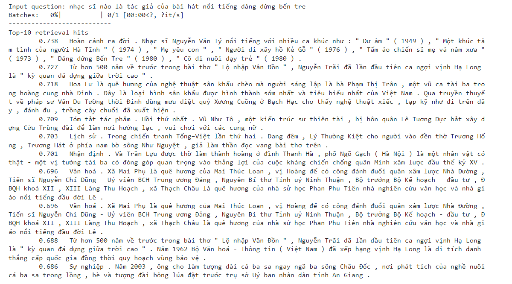

# QA_ZaloAIChallenge

Dự án này được tôi thực hiện để tạo ra 1 chatbot có thể trả lời được những câu hỏi Tiếng Việt

Dự án gồm 2 phần, phần thứ nhất là nội dung bài toán Question Answering và phần thứ 2 là Reading Comprehension

## Question Answering

Đối với phần QA, đầu vào sẽ bao gồm câu hỏi và đoạn văn chứa câu trả lời của câu hỏi đó (query - context)
Mô hình sẽ tìm các học để suy diễn context phù hợp nhất với query đầu vào

Đối với pha này, mô hình sẽ bao gồm 2 phần Retrieval Information và Rerank, tôi sử dụng kỹ thuật Finetuning Bert Pretrain Model cho tiếng việt dựa trên bộ dữ liệu ZALO-AI_CHALLENGE 2022.

Dưới đây là 1 demo của pha này

